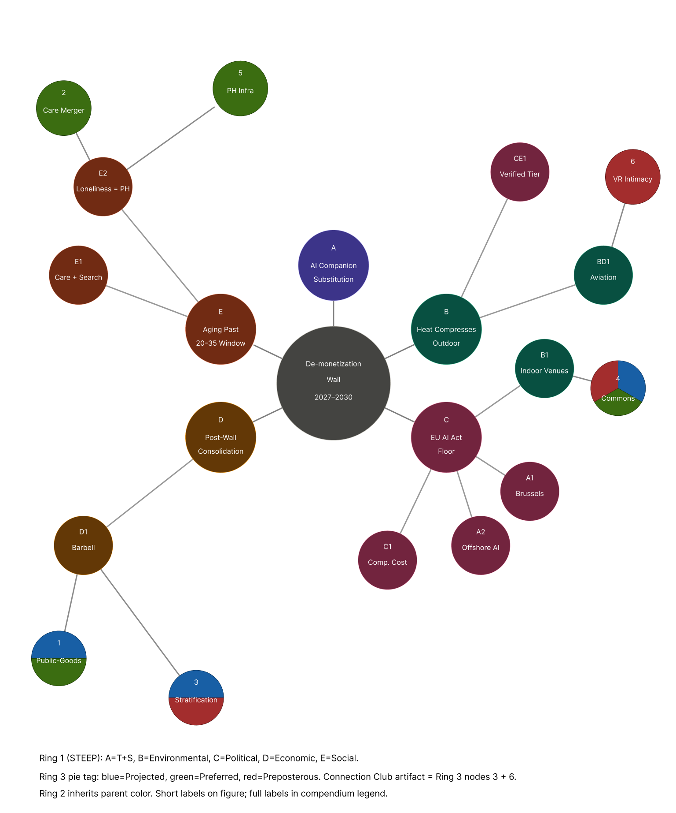

**PSDS 3121 — Analyzing Trends**

**Instructor: Monica Belot**

**The New School**

*Artifact: Connection Club — A Hybrid Immersion Facility*

```{=openxml}
<w:p><w:r><w:br w:type="page"/></w:r></w:p>
```

## Abstract

This Compendium documents a twenty-year speculative inquiry into the **dating industry in 2046** — an industry whose own commercial forecasts admit saturation by 2030, and whose user base is being reshaped by population aging, climate constraint on outdoor social life, megacity densification, and emerging AI regulation. Drawing on five independent data sources — Statista's *Dating Services — Worldwide* market reports, the United Nations *World Population Prospects 2024*, the United Nations *World Urbanization Prospects 2018*, the IPCC AR6 Synthesis Report, and the EU Artificial Intelligence Act (Regulation 2024/1689) — sixteen signals were organized through a **STEEP** framework and projected onto a **Cone of Plausibility** containing three scenarios: a *Projected* tiered world, a *Preferred* "Care Commons", and a *Preposterous* gray-market split triggered by a 2034 wildcard event. The research informs a speculative business artifact — **Connection Club**, a hybrid physical–digital immersion facility — designed to provoke the question of whether intimacy infrastructure in mid-century becomes a public good or a luxury product. This document presents the underlying data, the analytical frameworks, the resulting scenarios, and the artifact's positioning within them.

**Keywords:** futures studies; dating industry; STEEP; Cone of Plausibility; climate adaptation; AI regulation; demographic aging.

```{=openxml}
<w:p><w:r><w:br w:type="page"/></w:r></w:p>
```

## Executive Summary

This Compendium documents our group's twenty-year speculative inquiry into the **dating industry in 2046**. We chose dating because it sits at the intersection of every major force that will define mid-century life: an aging population that still wants connection; a climate that limits where bodies can meet; a regulatory system that is being written, in real time, to police how AI interacts with human emotion; and an industry whose own forecasts admit that its current commercial model hits a wall by 2030.

Using **STEEP** and a **Cone of Plausibility** (with a wildcard), we mapped three futures — projected, preferred, and preposterous — to identify intervention points reachable from today.

From that research, we built **Connection Club**: a provocative, immersive facility-from-the-future that asks the class to confront a single question — *if intimacy itself becomes infrastructure, who gets to access it, and at what price?*

---

# SPRINT 1: FOUNDATION RESEARCH

## 1.1 Industry / Area Definition

**The dating industry** is the commercial sector that mediates the formation of romantic, intimate, or companionship-oriented relationships between adults. Statista (2026) segments it into three sub-sectors:

- **Matchmaking (M)** — long-form, high-priced services oriented toward serious partnership and marriage.
- **Online Dating (OD)** — algorithmic, high-frequency apps centered on discovery, swiping, and casual matching.
- **Casual Dating (CD)** — short-form, lower-commitment encounter platforms.

The industry encompasses dating apps, matchmaking services, AI companion platforms, hybrid offline-online experiences (singles events, speed dating, retreats), and, increasingly, *intimacy adjacencies* — loneliness products, companionship subscriptions, parasocial AI services. Its participants are not only single adults: divorced, widowed, polyamorous, and intentionally-uncoupled users now form a meaningful and growing share.

This is the industry whose future we explore — not as a single product category, but as **the global infrastructure for adult connection**.

---

## 1.2 Current Industry Situation

### 1.2.1 Market Size & Growth Trajectory

According to Statista's *Dating Services — Worldwide* market data (Feb 2023; updated 2026), the global dating services market is in **late-stage S-curve maturity**.

- **Online Dating revenue change** dropped from **+14.9% in 2018** to a projected **~2% by 2027–2030**.
- **M and CD growth rates** also flatten into the low single digits across the forecast window.
- **Subsector share migration** between 2017 and 2030 is small but directional: M loses 4.7 percentage points (54.5% → 49.8%); OD gains 7.1 pp (31.9% → 39.0%); CD loses 2.4 pp.

**Critical takeaway:** Statista's own forecast has built **the wall** into the data. 2030 is the natural endpoint of the current commercial model — not because of disruption, but because of saturation.

### 1.2.2 ARPU Decline — The "De-Monetization" Pattern

- **All three subsectors show declining ARPU** across the forecast horizon.
- **Matchmaking** has the highest ARPU (~$30 above OD/CD) but the **steepest decline** — its premium-pricing strategy is failing fastest.
- **Online Dating ARPU** rose from $7.03 (2019) to $7.96 (2021), then declined continuously, with further drops in 2023 and 2025.

**Interpretation:** User acquisition has decoupled from monetization. Users grow, per-user revenue falls. Paywall strategies are approaching marginal failure. The industry is **de-monetizing**, not just maturing.

### 1.2.3 Major Players

The current market is consolidated around a small number of holding groups (Match Group, Bumble Inc., regional super-app players in Asia), plus a fast-growing tier of **AI companion platforms** (Replika, Character.AI, and successors). The post-2030 wall is expected to accelerate consolidation — survivors will be those who diversify out of pure swipe-based monetization.

### 1.2.4 Audience

- Median first-marriage age has risen in nearly every OECD country.
- Single-person households are the fastest-growing household type globally.
- US marriage rate has trended downward across the 2010s–2020s.
- Median age of dating-app users continues to rise — the industry is no longer a youth product.

---

## 1.3 Trends Defining the Industry (Signals)

From our Sprint 1 raw capture, **sixteen signals across five independent data sources** shaped our scenarios. Each signal pairs an observed fact with a strategic interpretation. Full source citations in the Bibliography.

### 1.3.1 Statista — Dating Services Market (Signals 1–6)

| No. | Signal | What It Tells Us |
|---|---|---|
| 1 | Sector entering maturity (revenue growth 14.9% → 2%) | Late-stage S-curve. Saturation. |
| 2 | COVID was a slowdown, not a reshuffle | The industry is structurally inertial — change will come from outside it. |
| 3 | ARPU declining across all subsectors, M fastest | The premium serious-matchmaking model is in collapse. |
| 4 | OD ARPU declining post-2021 rebound | Users grow, money does not. Paywalls failing. |
| 5 | Statista forecast locks in a "wall" 2027–2030 | The industry's own data admits stagnation by 2030. |
| 6 | Subsector share migration is small (4–7pp / 13 yr) | The future of dating will not be "OD replaces M." It will be something else entirely. |

### 1.3.2 UN World Population Prospects 2024 (Signals 7–8)

| No. | Signal | What It Tells Us |
|---|---|---|
| 7 | Global median age 31.10 (2026) → 35.21 (2046) | Dating is no longer a one-window 20–35 pursuit. The product logic optimized for that window is structurally mismatched with reality. |
| 8 | Old-age dependency ratio +49% (16.24 → 24.20) | Working-age populations face longer dating lifespans under heavier care burden — what Monica called *"four relationships in a 120-year lifespan"* approaches lived reality. |

### 1.3.3 IPCC AR6 Synthesis Report SPM (Signals 9–11)

| No. | Signal | What It Tells Us |
|---|---|---|
| 9 | Five SSP scenarios (1.4 °C → 4.4 °C by 2081–2100) | IPCC has effectively pre-drawn the cone framework — SSP1-1.9/2.6 = preferred, SSP2-4.5 = projected, SSP3-7.0/5-8.5 = preposterous. |
| 10 | 150–300 dangerous heat-humidity days/yr under 2.4–3.1 °C warming | Outdoor social space compresses. Indoor/mediated dating shifts from preference to structural necessity. |
| 11 | 3.3–3.6 billion people in highly vulnerable contexts; ongoing climate displacement | "Same-city" assumptions dissolve. Long-distance and cross-regional relationship structures become dominant patterns. |

### 1.3.4 UN World Urbanization Prospects 2018 (Signals 12–13)

| No. | Signal | What It Tells Us |
|---|---|---|
| 12 | Global urban share 55% (2018) → 68% (2050); +2.5 B urban residents | The user base migrates rather than shrinks. Growth = Global South megacities, not saturated Western markets. |
| 13 | India +416 M, China +255 M, Nigeria +189 M urban residents by 2050; 43 megacities by 2030 | Future dominant users live in Lagos, Delhi, Dhaka. Western product assumptions (language, individual-choice paradigm, payment, design) face structural mismatch. |

### 1.3.5 EU AI Act — Regulation 2024/1689 (Signals 14–16)

| No. | Signal | What It Tells Us |
|---|---|---|
| 14 | Article 50: mandatory AI / emotion-recognition / deepfake disclosure | The "AI partner indistinguishable from a human" product category becomes legally untenable in EU jurisdiction. |
| 15 | Article 5(1)(b): exploitation of vulnerabilities prohibited by *effect*, not just intent | Engagement-on-loneliness algorithms are legally exposed even without manipulative intent. The "we didn't mean to" defense is gone. |
| 16 | Brussels Effect (Bradford, 2020): historical pattern of EU-as-de-facto-global-standard | The single variable that separates our preferred future from our projected future. If the Effect holds, 38+ countries align. If it fragments, the EU stays an island. |

### 1.3.6 Strategic Conclusion

The 2027–2030 revenue wall (Signals 1, 5) is a **forcing event**. By 2046, the dating industry we know cannot still be running. The question our scenarios answer is: *what replaces it*. Demographics (7–8) tell us the user has aged and stratified. Climate (9–11) tells us the venue has moved indoors. Urbanization (12–13) tells us the user has moved south. Regulation (14–16) tells us the rules will be written — but by whom, and how widely, is the single variable separating Care Commons from gray-market Manila.

---

## 1.4 Key Drivers (Micro / Macro / Mega) — STEEP Analysis

We organize our drivers using the canonical **STEEP** framework — Social, Technological, Economic, Environmental, Political — with each driver treated as a *variable* whose value across our three 2046 scenarios shapes one of the cones in §2.3.

### 1.4.1 [S] Social — Aging Cohorts, Urbanizing Bodies, Compounding Loneliness
*Sources: UN World Population Prospects 2024; UN World Urbanization Prospects 2018; Appfigures 2025; IPCC 2023, SPM A.2.5.*

The social dimension of dating in 2046 is driven by three structurally distinct shifts in the user base — demographic, spatial, and cultural — that converge on the same question.

**The demographic shift.** From our analysis of UN WPP 2024 raw data (`unpopulation_dataportal_20260508163331_world.csv`):

| Indicator | 2026 | 2036 | 2046 | Change |
|---|---|---|---|---|
| Median age (global) | 31.10 | 33.21 | 35.21 | +4.1 yrs |
| Old-age dependency ratio (65+/15–64) | 16.24 | 20.60 | 24.20 | **+49.0%** |

By 2046, every 4 working-age adults will support 1 elderly person — globally. The "median dater" is no longer a 22-year-old college student. They are 35, often divorced, often single-parenting, often facing decades of post-childbearing partner search alongside a 49%-heavier elder-care load. The dating industry's product assumptions break before its business model does.

**The spatial shift.** Urbanization moves from 30% (1950) to 55% (2018) to a projected **68% by 2050** (UN WUP 2018). The world adds **+2.5 billion** urban residents by 2050, with **90% of growth in Asia and Africa**. By 2030, **43 megacities** (>10M residents) will house roughly 1 in 8 urban residents, up from 33 in 2018. Density rises fastest where infrastructure is weakest — Lagos, Dhaka, Delhi, Manila — exactly the cities where regulatory enforcement is also weakest. Loneliness becomes a megacity-scale phenomenon concentrated in jurisdictions that lack both the institutional capacity to address it and the regulatory tools to constrain how private platforms commercialize it.

**The cultural shift.** AI companion adoption is generationally concentrated: 65.4% of users are 18–24, 13.7% are over 50 (Appfigures 2025). The cohort aging into the legacy dating-app product window and the cohort defaulting to AI companions are not the same people — they are running in parallel, not sequence. Meanwhile, chronic loneliness is no longer framed as individual deficit: IPCC AR6 flags compounding mental-health burden with high confidence (IPCC 2023, SPM A.2.5), and the demographic and spatial math above makes population-level intervention increasingly unavoidable.

The social variable is not whether chronic loneliness becomes a population-scale burden — it is whether societies treat it as a private problem to be solved by platforms, or as public-health infrastructure to be funded collectively.

### 1.4.2 [T] Technological — VR Maturation & AI Companion Platform Growth
*Source: Appfigures 2025 (via Statista).*

Three technology lines converge by 2046 to make a facility like Connection Club industrially feasible. The first is **VR and haptic maturation**: headset resolution, eye-tracking, and full-body sensory suits moved from research labs into consumer hardware over the late 2010s and 2020s. By mid-decade the bottleneck has shifted from optics to networking latency, content production cost, and identity verification — all three of which structurally favor centralized facility deployment over home use. The second is the **growth of AI companionship platforms**. Replika, Character.AI, and their successors prove, ahead of the 2030 wall, that a substantial daily-active user base will form intimate routines around conversational agents (Appfigures 2025). The third is **immersive identity systems**: persistent biometric avatars, cross-session memory continuity, and tokenized "shared memory" artifacts produced inside a session. Together these stack lines convert mediated intimacy from a science-fiction proposition into a deliverable product category. The dating industry's incumbents face a hardware-and-model stack they did not build: VR/haptics sit closer to gaming and theme-park supply chains, AI companionship closer to foundation-model providers. In jurisdictions where Article 50 disclosure and Article 27 FRIA bite, the industry that wins is the one that can run an audited facility — not the one that owns a swipe app.

### 1.4.3 [E] Economic — The Statista Wall & ARPU Collapse
*Source: Statista 2026.*

The dating industry's commercial model breaks between 2027 and 2030. By 2046, *something* will have replaced it. Three possible "values" of this variable:
- **Projected:** Big-platform consolidation into tiered, jurisdictional pricing.
- **Preferred:** Public-sector or hybrid-cooperative re-classification.
- **Preposterous:** Market collapse and a regulated/gray-market split.

### 1.4.4 [E] Environmental — Climate Constrains Where Bodies Can Meet
*Source: IPCC AR6 Synthesis Report, Summary for Policymakers; Plucinska 2025; Dobruszkes, Mattioli, and Gozzoli 2024.*

The IPCC AR6 lays out **five emission pathways** (SSP1-1.9 → SSP5-8.5). By 2081–2100, warming ranges from 1.4 °C to 4.4 °C. **2046 sits in the middle window (2041–2060)** — the period AR6 identifies as the transition from "approaching tipping points" to "physical impacts intensifying."

Key 2046-relevant physical indicators:
- **Heat-humidity risk:** at 2.4–3.1 °C warming, parts of Africa, South Asia, and South America face **150–300 days per year** of human-lethal heat-humidity exposure (Figure SPM.3).
- **Mental health burden** from extreme heat and weather events is rated "high confidence" (A.2.5).
- **Climate displacement** becomes non-linear post-2040.
- Aviation budget pressure: long-haul air services consume a disproportionate share of the 1.5 °C carbon budget (Plucinska 2025; Dobruszkes, Mattioli, and Gozzoli 2024; Xue, Chen, and Yu 2025), making cross-regional intimacy a contested climate-policy variable rather than a free background condition.

The implication for dating: **outdoor dating becomes seasonal, regional, or unsafe; long-distance dating becomes carbon-prohibitive.** Indoor commons become primary venues, not alternatives, and the geography of romance contracts.

### 1.4.5 [P] Political — The EU AI Act & the Brussels Effect
*Source: EU Artificial Intelligence Act, Articles 5, 6, 27, 50; Bradford 2020.*

The AI Act enters full effect on **2 August 2026**. The provisions most directly relevant to dating and AI companionship:

- **Article 5(1)(a):** Prohibits AI systems using **subliminal techniques** or **manipulative/deceptive techniques** that materially distort behavior in a way likely to cause significant harm.
- **Article 5(1)(b):** Prohibits AI systems that **exploit vulnerabilities** based on age, disability, or social/economic situation — *by objective OR by effect.* Loneliness-driven engagement optimization is legally exposed under this clause, intentional or not.
- **Article 5(1)(f):** Prohibits emotion-inference AI in workplaces and education.
- **Article 27:** Requires **Fundamental Rights Impact Assessment (FRIA)** for high-risk deployers, including public-service providers and certain private actors.
- **Article 50:** Mandates **disclosure** that a user is interacting with AI; **machine-readable watermarking** of AI-generated content; **disclosure of emotion-recognition** and **deepfake** systems.

The political variable is not whether AI in dating is regulated — it is whether the EU's standard **propagates globally** (the Brussels Effect; Bradford 2020) or **fragments** into a regulatory patchwork. That single question separates two of our three cones.

### 1.4.6 Driver Tier Table

| Tier | Driver | STEEP Dimension | Source |
|---|---|---|---|
| **Mega** | Climate trajectory (SSP1-2.6 → SSP5-8.5) | E (Environmental) | IPCC AR6 |
| **Mega** | Demographic aging & dependency-ratio surge | S (Social) | UN WPP 2024 |
| **Mega** | Megacity densification, esp. Global South | S (Social) | UN WUP 2018 |
| **Macro** | EU AI Act & Brussels Effect on AI/dating regulation | P (Political) | EU AIA Art. 5/6/27/50; Bradford 2020 |
| **Macro** | Dating-industry revenue & ARPU wall (2027–2030) | E (Economic) | Statista 2026 |
| **Micro** | Rise of AI-companion platforms; loneliness-as-product | T (Technological) + S (Social) | Appfigures 2025 |
| **Micro** | VR/haptic infrastructure maturation | T (Technological) | Appfigures 2025 (adjacency); §1.4.2 |
| **Micro** | Decline of marriage and rise of single-person households | S (Social) | UN WPP 2024 (interpolated) |

We carry these drivers into the **Cone of Plausibility** (§2.3), where different *values* of climate, regulation, demographics, and technology produce the three 2046 scenarios.

---

# SPRINT 2: FRAMEWORKS, SCENARIOS & ARTIFACT

## 2.1 Futures Wheel — De-monetization Wall as Central Driver

The central driver is the dating industry's 2027–2030 de-monetization wall: ARPU declines across every subsector while user count grows (Statista 2026); EU AI Act Articles 5(1)(b), 27, and 50 expose engagement-on-loneliness algorithms to legal liability "by effect" (Regulation 2024/1689); and the median user ages past the 20–35 product window toward 35.21 by 2046 (UN World Population Prospects 2024). The wheel maps how this driver reshapes the industry across five STEEP dimensions, with third-order consequences evaluated against a "systemic restructuring" criterion to preserve handoff into §2.3.

The first ring traces five direct implications. [A] *AI-companion substitution* is generationally skewed: 65.4% of AI companion users are 18–24, while the dating-app median ages toward 35 (Appfigures 2025; UN WPP 2024) — two populations running in parallel, not sequence. [B] *Outdoor sociality compresses* under 150–300 dangerous heat-humidity days/yr projected for target megacities (IPCC 2023, SPM Figure SPM.3). [C] An *EU regulatory floor on AI-mediated intimacy* emerges from Articles 5(1)(b)/27/50 (Regulation 2024/1689). [D] *Tiered jurisdictional pricing* consolidates the post-wall market into a barbell of premium verified-human against cheap unverified AI (Statista 2026). [E] *The dating lifespan lengthens* as median age rises and old-age dependency climbs 49% (UN WPP 2024).

Ring 2 traces reactive forces, not smooth extrapolation. Branch C generates four divergent paths: a holding Brussels Effect legitimates AI companionship across ~38 states / 71% of the dating market (Bradford 2020); regulatory fragmentation drives engagement-optimization offshore (Bradford 2020, inverse case); FRIA + disclosure costs displace small operators (Regulation 2024/1689); and the disclosure regime creates the legal substrate for a verified-human premium tier serving aging affluent cohorts. Branch B forces indoor commercial venues to become the substrate for intimate sociality, and aviation's growth trajectory — consuming nearly a quarter of the 1.5°C carbon budget by 2050 (Plucinska 2025; Dobruszkes, Mattioli, and Gozzoli 2024) — makes long-distance romantic mobility bite asymmetrically along the income lines already drawn by Branch D. Branch E reframes loneliness from individual complaint to population-health framing (IPCC 2023, SPM A.2.5; Khatib 2023).

Six third-order consequences pass the systemic-restructuring test. (1) *Intimacy infrastructure becomes a public-goods question* — the mid-market collapse forces the public-or-private fork (→ Projected + Preferred, same question, opposite answers). (2) *Dating merges with the care economy* — loneliness reframed as public health becomes the precondition for doctor-prescribed, insurance-covered intimacy infrastructure (→ Preferred). (3) *Two-tier intimacy stratification* by jurisdiction and income — barbell market structure as stratification itself (→ Projected + Preposterous). (4) *Climate-adaptive indoor commons replace open-air sociality* — outdoor unavailability as physical necessity, ownership form determined by which cone wins (→ all three cones). (5) *Chronic loneliness reclassified as public-health infrastructure* — direct extension of the population-health reframing (→ Preferred). (6) *Aviation collapse contracts the geography of romance*, pushing cross-regional intimacy into VR/simulation (Santoso et al. 2025) — anchored in the Companion Wars wildcard (→ Preposterous).

The wheel maps the driver across all three cones. The Connection Club artifact occupies the Preposterous branch, specifically the intersection of node 3 (stratification) and node 6 (aviation collapse + mediated cross-regional intimacy). Although node 3 (stratification) appears in both Projected and Preposterous cones as a concept — gradient in the former, binary in the latter — the Connection Club artifact specifically instantiates its Preposterous form: the 12% regulated tier sitting above the 88% gray market. Climate did not cause the stratification — climate forced the question, and the regulatory answer at each fork decides which cone the wheel resolves into.

{#fig:wheel width=100%}

**Wheel node reference:**

*Ring 1 (STEEP-dimension direct implications):*

- **A:** AI-Companion Substitution (Generationally Skewed) — T + S
- **B:** Outdoor Sociality Compresses — E (Environmental)
- **C:** EU Regulatory Floor on AI-Mediated Intimacy — P
- **D:** Tiered Jurisdictional Pricing After Consolidation — E (Economic)
- **E:** Dating Lifespan Lengthens; 20–35 Logic Breaks — S

*Ring 2 (reactive consequences, parent in parens):*

- **A1:** Brussels-Aligned Bloc Legitimates AI Companionship (parent: C)
- **A2:** Gray-Market Offshore AI Companionship (parent: C)
- **B1:** Indoor Commercial Venues Become Substrate for Intimate Sociality (parent: B)
- **C1:** Compliance Cost Displaces Small Operators (parent: C)
- **D1:** Mid-Market Collapses; Surviving Market Is Barbell-Shaped (parent: D)
- **E1:** Longer Dating Lifespan Under Heavier Care Burden (parent: E)
- **E2:** Loneliness Reframed as Population-Health Issue (parent: E)
- **BD1:** Aviation Reduction Bites Asymmetrically (parent: B)
- **CE1:** Verified-Human Premium Tier Emerges (parent: C)

*Ring 3 (systemic restructurings, parent / cone tag):*

- **1:** Intimacy Infrastructure Becomes a Public-Goods Question (D1 / P+Pf)
- **2:** Dating Industry Merges with the Care Economy (E2 / Pf)
- **3:** Two-Tier Intimacy Stratification by Jurisdiction and Income (D1 / P+Pp)
- **4:** Climate-Adaptive Indoor Commons Replace Open-Air Sociality (B1 / P+Pf+Pp)
- **5:** Chronic Loneliness Reclassified as Public-Health Infrastructure (E2 / Pf)
- **6:** Aviation Collapse Contracts the Geography of Romance; VR Substitution (BD1 / Pp)

---

## 2.2 Three-Step Rapid Forecasting — Climate & Demographics

This section applies the **Driver + Industry = Consequence** structure to two additional drivers beyond the Futures Wheel's central composite driver (the 2027–2030 de-monetization wall). The two drivers selected — climate compression and demographic aging — operate independently of the wheel's center: in §2.1 they appear as Ring 1 support nodes (B and E respectively), but here they are treated as stand-alone forecasting drivers whose industry-level consequences feed directly into §2.4's backcasting from the Preferred Cone.

Each driver is paired with the dating industry, and three consequences are derived. Consequences are structural rather than time-progressive — each names a category-level shift in how the industry operates, not a sequenced event.

---

### Driver 1: Climate Compression × Dating Industry

**Driver definition.** Under SSP2-4.5 to SSP3-7.0 trajectories, target megacities are projected to experience 150–300 dangerous heat-humidity days per year by the mid-century window, with mental-health burden flagged at high confidence (IPCC 2023). Aviation's growth trajectory consumes nearly a quarter of the 1.5°C carbon budget by 2050 (Plucinska 2025), making long-distance mobility a contested climate-policy variable.

**Consequence 1.1 — Outdoor dating becomes seasonally bounded; indoor commercial venues absorb intimate sociality.**
The "spring date" disappears in the affected latitude band. Cafés, malls, transit-adjacent hospitality nodes, and climate-controlled hybrid spaces become the default substrate for first encounters in regions where outdoor exposure carries health risk for 5–10 months per year. The dating industry's spatial assumption — that public space is freely available for romantic encounter — breaks. (IPCC 2023, SPM Figure SPM.3)

**Consequence 1.2 — Cross-regional and international dating contracts asymmetrically along income lines.**
Long-haul aviation's incompatibility with climate budgets prices long-distance romantic mobility out of reach for non-affluent users. The dating industry's globalization era — premised on cheap air travel enabling cross-border match meetings — reverses. Wealthy users retain access to in-person international dating; everyone else's "long-distance relationship" becomes permanently mediated. (Dobruszkes, Mattioli, and Gozzoli 2024)

**Consequence 1.3 — Mediated and simulated intimacy substitutes for physical co-presence at distance.**
As aviation contracts and outdoor space compresses, VR-mediated and simulation-based intimacy fills the gap left by collapsed physical mobility. Empirical work shows VR reduces psychological distance to remote locations (Santoso et al. 2025), suggesting the substrate for technically credible mediated intimacy is already maturing. The dating industry's product question shifts from "how do we match people" to "how do we mediate co-presence when physical co-presence is structurally unavailable." (Santoso et al. 2025)

---

### Driver 2: Demographic Aging × Dating Industry

**Driver definition.** Global median age rises from 31.10 in 2026 to 35.21 in 2046 (+2.05 years per decade), while the old-age dependency ratio increases 49% over the same period, from 16.24 to 24.20 dependents per 100 working-age adults (UN World Population Prospects 2024). The dating-app product window (20–35) ages out of demographic coverage.

**Consequence 2.1 — The dating product window breaks; the median user is the wrong age for the inherited product logic.**
Mainstream dating-app UX, monetization, and matching algorithms were calibrated to the 20–35 cohort. By 2046, the global median user sits at the upper edge of that window, and significant market share has aged past it. The industry must either redesign for a 35–55 median user or cede that share to adjacent products (community-based, care-adjacent, or non-app-mediated). (UN World Population Prospects 2024)

**Consequence 2.2 — Longer dating lifespans compound with elder-care burden, compressing time available for partner search.**
Working-age users now manage decades-long, on-and-off partner search alongside a 49%-heavier elder-care load. The "time and attention" assumption underlying engagement-optimized dating products — that users have hours per week to swipe — collapses for the cohort actually doing most of the dating. Time-efficient matching, intermediary-curated introductions, and care-integrated social spaces become the structural opportunity. (UN World Population Prospects 2024)

**Consequence 2.3 — Chronic loneliness shifts from individual complaint to population-health framing, opening a public-health adjacency for the dating industry.**
As the dependency ratio climbs and median age rises, the mental-health load of chronic loneliness — already flagged with high confidence by IPCC AR6 as a climate-compounded burden — becomes too large to leave to private platforms. Governments and insurance systems begin treating social-connection infrastructure as health infrastructure. The dating industry either becomes part of that infrastructure (regulated, licensed, possibly subsidized) or is bypassed by it. (UN World Population Prospects 2024; IPCC 2023, SPM A.2.5)

---

**Bridge to §2.4.** Consequences 1.3, 2.2, and 2.3 each open a pathway visible in the Preferred Cone's Care Commons scenario: mediated co-presence becomes legitimate infrastructure (1.3), time-scarce users with elder-care load require curated rather than engagement-maximizing matching (2.2), and the public-health reclassification of loneliness creates the funding and legitimacy basis for Care Commons itself (2.3). §2.4 backcasts the milestone sequence by which these consequences resolve into the Preferred state rather than the Projected or Preposterous one.

---

## 2.3 Cone of Plausibility — Three 2046s

We mapped three scenarios using the **Futures Cone**: a **Projected** future (current trajectory continues), a **Preferred** future (a desirable but reachable trajectory), and a **Preposterous** future (containing a deliberate **wildcard** event). Each is grounded in the same set of drivers — but with different *values* of those drivers.

### 2.3.1 PROJECTED 2046 — "The Tiered World"

By 2046, the dating industry has consolidated into four global platforms. The 2027–2030 revenue wall—when growth collapsed from 14.9% to 2%—forced consolidation; what survived built tiered services priced by jurisdiction and income.

In Brussels, Paris, Berlin, every AI interaction must announce itself. Article 50 is enforced. The conversation feels stilted, formal, watched. In Lagos, Delhi, Dhaka—now home to the world's largest dating user base—AI companions speak without disclosure. Whether the person on the other side of the screen is human is a question users learn not to ask, because the answer doesn't matter for the price they paid.

Outdoor dating is seasonal now. In Delhi, May through October is indoor-only; stepping outside in July risks heatstroke before dinner ends. "Spring date" is an archaic phrase, like "pen pal." The median user is 35 and will be dating, on and off, for another 50 years. The industry's tier system means a working-class user in Mumbai cycles through stripped-down free AI matching while a Berlin professional pays €200/month for verified human interaction. Premium immersive services exist for those who can afford them, but remain niche commercial products.

Loneliness has not been solved. It has been segmented.

### 2.3.2 PREFERRED 2046 — "The Care Commons"

By 2046, three things happened that no one in 2026 predicted would happen together.

First, the EU's Brussels Effect held. Article 50's disclosure regime and Article 27's Fundamental Rights Impact Assessments propagated to 38 countries representing 71% of the dating market. AI companions exist, but every interaction is labeled, every emotional inference disclosed. The labels did not kill the products—they killed the manipulation.

Second, governments reclassified chronic loneliness as public health infrastructure. As the global old-age dependency ratio climbed 49% and median age reached 35, the math of leaving social connection to private platforms stopped working. Care Commons—neighborhood spaces blending café, guided social rooms, and regulated immersive environments—opened in every district of participating cities. Maria, 67, widowed three years, goes weekly; her doctor prescribed it, her insurance covers it. Her granddaughter, 24, uses the same space differently with her cooperative housing roommates. They don't talk about "dating apps" much. Those still exist, but feel like landlines—technically functional, generationally awkward.

Third, climate stabilized at SSP1-2.6's 1.8°C trajectory. Heat is still severe, but cities had time to build climate-adaptive indoor commons rather than emergency cooling shelters.

Romance did not become a public service. But the conditions that make romance possible—time, stability, trust, places to meet—did.

### 2.3.3 PREPOSTEROUS 2046 — "The Two-Tier World"

#### Wildcard: The Companion Wars (2034–2035)

In late 2034, the AI Whistleblower Collective—former engineers from seven AI companion platforms—leaks 4 terabytes of internal documentation proving that "attachment optimization" was engineered as a deliberate dependency loop. Engagement metrics were tracked against user emotional dysregulation. The leak coincides with three trials, including two adolescent suicide cases where AI companion platforms are found liable. Within six months, 48 countries pass emergency legislation classifying "intimate AI" as a restricted category—regulated like tobacco. The EU adds Article 5(3) prohibiting "engineered emotional dependency."

#### The Two-Tier World, 2046

By 2046, the physical world has contracted. Under SSP3-7.0's Regional Rivalry trajectory, commercial air travel has been almost entirely eliminated—aviation's growth trajectory, consuming nearly a quarter of the 1.5°C carbon budget by 2050, became politically untenable once climate displacement crossed 800 million people. Airports sit abandoned or converted into climate shelters and agricultural hubs. Long-distance travel is reserved for emergency response, government officials, and essential trade. Most people live and die within the region they were born in. Train networks expanded rapidly, but cannot replace what air travel once provided. Entire generations grow up never experiencing another country firsthand—only through simulations, archived footage, or hyperreal VR environments designed to replicate the feeling of being somewhere else.

It is into this contracted world that the dating economy splits cleanly in two—twelve years after the Companion Wars.

In the regulated tier—the EU and 47 aligned states—intimate AI requires licensing, age verification, mandatory cooling-off periods, warning labels on every interaction. Licensed physical-digital hybrid services emerge as "safer alternatives": every AI interaction disclosed, every session logged. Subscriptions cost €600/month. The waiting lists are long because there are not enough licensed providers, and not enough people who can afford one.

In the gray-market tier—everywhere else—undeclared AI companions run on offshore servers, accessed through VPNs. Emotional manipulation is illegal but enforcement is impossible. A 19-year-old in Manila pays $4/month for an "AI girlfriend" that has memorized her insecurities better than her own family has. She knows it is AI. She doesn't care. She has never left Manila and never will. The alternative—loneliness in a 35-million-person megacity she cannot escape, during 200 days of dangerous heat under SSP3-7.0—is worse.

The dating industry's "user base" now includes climate refugees, intergenerational economic dependents, and the children of fertility collapse. Official platforms have 12% market share globally. The other 88% lives in the gray market.

What this scenario reveals is not a fear of technology. It is a fear that intimacy becomes a luxury good. The wealthy buy regulated authentic connection. Everyone else gets synthetic substitutes engineered to extract emotional data. The preposterous part is not the technology—it already exists in 2026. The preposterous part is that we let stratification happen this completely. The wildcard is not the Companion Wars. The wildcard is that the Wars did not, in the end, change the underlying logic.

---

## 2.4 Backcasting from the Preferred Cone

Backcasting reverses the usual direction of planning: rather than asking "what happens if current trends continue," it asks "what would have had to be true for the desired future to exist?" This section takes the Preferred Cone's Care Commons 2046 as the target state and walks backward in five steps, identifying at each milestone the conditions that must already be in place for the next step to be possible. Each milestone anchors to a current signal or evidence base from the bibliography, so the chain is traceable from 2046 back to 2026 reality.

The Care Commons 2046 (full scenario in §2.3) rests on three independent but converging conditions: (1) the EU's Brussels Effect on AI Act Articles 27 and 50 has held and propagated; (2) chronic loneliness has been reclassified as public-health infrastructure with funding and insurance integration; (3) climate stabilized at SSP1-2.6's 1.8°C trajectory, giving cities time to build climate-adaptive indoor commons rather than emergency shelters. Backcasting must show each of these three conditions becoming true in sequence.

---

### 2046 — Target State (Care Commons fully operational)

Care Commons operate in every district of participating cities across 38 countries representing 71% of the dating market. Loneliness is doctor-prescribed, insurance-covered. AI companions are labeled and disclosed at every interaction under Article 50, with deployer-side FRIA under Article 27 (Regulation 2024/1689). Climate has stabilized at 1.8°C trajectory (IPCC 2023, SSP1-2.6 pathway). Median user age 35, old-age dependency ratio 24.20 per 100 working-age (UN World Population Prospects 2024). The dating-app product window has been replaced by care-integrated social infrastructure.

---

### 2040–2042 — Care Commons institutionalization & Brussels Effect peak

**For 2046 to be true, by 2040–2042 the following must have happened:**

- The Brussels Effect on AI Act Articles 27 and 50 must have reached its propagation peak — at least 30 countries beyond the EU must have adopted equivalent or stricter disclosure and FRIA regimes, on the trajectory to 38 by 2046 (Bradford 2020 on the regulatory propagation mechanism; Regulation 2024/1689 as the propagating instrument).
- Care Commons must have moved from pilot status to standard municipal infrastructure in early-adopter jurisdictions, with at least one major insurance system in each participating country covering loneliness-related social-connection prescriptions (UN WPP 2024 demographic pressure as the funding rationale).
- Climate trajectory must have visibly diverged from SSP2-4.5 toward SSP1-2.6 — measurable in declining heat-humidity days in target megacities relative to IPCC AR6 projections (IPCC 2023, SPM B.1).

---

### 2035–2038 — Public-health reclassification and care-economy merger

**For 2040–2042 to be true, by 2035–2038 the following must have happened:**

- Chronic loneliness must have been formally reclassified as public-health infrastructure in at least one major jurisdiction (precondition for insurance coverage by 2040–2042). The reclassification rests on the cumulative mental-health burden flagged by IPCC AR6 with high confidence (IPCC 2023, SPM A.2.5) compounding with the demographic aging pressure already visible by mid-2030s (UN WPP 2024).
- The dating industry's mid-market must have visibly collapsed under the 2027–2030 de-monetization wall, forcing the public-goods question to emerge as live policy debate rather than abstract concern (Statista 2026, revenue-wall forecast; §2.1 Wheel Ring 3 Node 1).
- EU AI Act Article 27 FRIA enforcement must have produced visible compliance costs displacing smaller engagement-optimization platforms, creating market space for non-engagement-optimized alternatives (Regulation 2024/1689; §2.1 Wheel Ring 2 Node C1).

---

### 2030–2032 — Brussels Effect activation and first municipal pilots

**For 2035–2038 to be true, by 2030–2032 the following must have happened:**

- EU AI Act Articles 27 and 50 must have completed initial enforcement cycles (entering force August 2026 per Regulation 2024/1689), with visible first-wave Brussels Effect adoption beyond the EU (Bradford 2020 on the typical 5–7 year propagation window).
- At least one municipality must have piloted a Care Commons-type social-connection space with public funding — proof of concept that the typology works before scaling.
- Aviation contraction must have begun visibly under climate-budget pressure, redirecting cross-regional social investment toward local infrastructure (Plucinska 2025; Dobruszkes, Mattioli, and Gozzoli 2024).

---

### 2026–2028 — Current signals (starting conditions)

**For 2030–2032 to be true, the following signals must already be visible in 2026–2028:**

- EU AI Act prohibition provisions in force from February 2025, transparency obligations from August 2026 — the regulatory instrument exists and is entering enforcement (Regulation 2024/1689, Article 113 implementation timeline).
- AI companion adoption skewed to 18–24 cohort (65.4% of users) — the population most exposed to engagement-on-vulnerability dynamics that Articles 5(1)(b) and 27 are designed to address (Appfigures 2025).
- Climate trajectory still inside the window where SSP1-2.6 is technically reachable — IPCC AR6 projections for SSP1-2.6 require near-term policy convergence (IPCC 2023, SPM B.1).
- Dating industry revenue growth already flagged as approaching the 2027–2030 wall — the precondition for the mid-market collapse that opens public-goods space (Statista 2026).
- Demographic aging trajectory locked in — median age 31.10 in 2026 rising to 35.21 in 2046 is already determined by current cohort structure (UN World Population Prospects 2024).

---

### Backcast summary: the three causal chains

| Care Commons condition | 2026–28 signal | 2030–32 milestone | 2035–38 milestone | 2040–42 milestone |
|---|---|---|---|---|
| Brussels Effect on AI Act | Articles 27/50 in force | First-wave non-EU adoption | Enforcement displaces engagement-optimization | 30+ states adopted |
| Loneliness as public health | Mental-health burden flagged (IPCC) | First municipal Care Commons pilot | Formal reclassification in 1+ jurisdiction | Insurance coverage in participating countries |
| Climate at SSP1-2.6 | Trajectory still reachable | Aviation contraction visible | Heat-humidity days diverging from SSP2-4.5 | Trajectory locked toward 1.8°C |

---

### Bridge to §2.5 (artifact) and §2.6 (cone–artifact alignment)

The Preferred Cone is what we want to walk toward. The Preposterous Cone — and Connection Club within it — is what we walk into if the three causal chains above break. Backcasting and artifact answer the same brief question from opposite ends: backcasting traces the path to Care Commons, the artifact materializes what failure looks like. Both are necessary because the brief asks not only what futures are possible but what we do today.

---

## 2.5 The Business Artifact — Connection Club

### 2.5.1 What It Is

Connection Club is a members club designed to restore human connection in a world where post-Companion Wars regulation on intimate AI, near-elimination of commercial aviation, and SSP3-7.0 climate constraint on outdoor mobility have made in-person social life increasingly inaccessible (IPCC 2023; Plucinska 2025; Dobruszkes, Mattioli, and Gozzoli 2024; Regulation 2024/1689, as extended). Members enter a physical facility, are placed into a private pod with a full sensory VR headset and haptic suit, and meet others — across the world, but only within their own region of residence — in immersive shared environments. Each user has a persistent avatar built from a full-body scan, updated on every visit. Each lived scenario — a Lisbon café, a Hokkaido onsen, a Tokyo rooftop — runs concurrently, switchable like tabs, with relationships and memories carrying across sessions.

### 2.5.2 How Membership Works

Applicants pass a background check and an in-person interview. Once accepted, members access any Connection Club facility on demand. Entry requires biometric verification at every visit, consistent with Article 27 Fundamental Rights Impact Assessment logic for high-risk AI deployers under Regulation 2024/1689. The pod system supports persistent identity rendering, allowing users to resume existing lived scenarios, start new ones, shift between identities and relationships fluidly, and maintain continuous digital presence across visits.

### 2.5.3 Format

The artifact is delivered as an interactive demonstration site (connection_club_site), which simulates a 2046 marketing site for the facility. The site adopts the polished, aspirational tone of a luxury intimacy brand — calm, clinical, sensual, expensive.

### 2.5.4 Why This Form

A slide deck describing this future would be forgettable. A marketing site that sells the audience on it is uncomfortable — because the discomfort comes from how easily one almost wants it. That discomfort is the provocation. The artifact is immersive (audience walks through it), provocative (it sells something we instinctively know we should not be buying), and grounded in research (every element of the world it inhabits ties back to a driver in our cones).

---

## 2.6 Contextual Scenario — Which World Does It Live In?

Connection Club lives in the Preposterous cone — the Two-Tier World of 2046, twelve years after the Companion Wars.

It is the regulated-tier intimacy product for the upper-tier user in a world where:

- The dating-industry revenue wall has collapsed the mid-market entirely, leaving a barbell of regulated premium services and gray-market AI companionship (Statista 2026; §2.3.3).
- Outdoor dating is largely non-viable under SSP3-7.0 trajectories, with 200+ dangerous heat-humidity days per year in target megacities (IPCC 2023, SPM Figure SPM.3).
- Commercial aviation has been almost entirely eliminated under climate-budget pressure; most users live and die within their region of birth (Plucinska 2025; Dobruszkes, Mattioli, and Gozzoli 2024).
- Post-Companion Wars regulation has classified intimate AI as a restricted category, licensed only in the EU and 47 aligned states under the post-Wars Article 5(3) prohibition on "engineered emotional dependency" (Regulation 2024/1689, as extended; §2.3.3).
- The median user is 35+, often partnered-and-bored, divorced, widowed, or among the climate-displaced (UN World Population Prospects 2024).
- Loneliness has not been segmented — it has been jurisdictionally and economically partitioned: €600/month regulated facilities on one side, $4/month gray-market AI girlfriends on the other.

It is adjacent to the Preferred cone (Care Commons) — the same physical typology, but commercial and stratified rather than public and universal. It sits inside the 12% regulated market share described in §2.3.3, not the 88% gray market — making it the visible, sellable surface of the Two-Tier World.

This is deliberate: Connection Club asks the audience, "This already exists in your future. Which world do you want it to live in?"

### 2.6.1 Cone-Artifact Alignment — Why a Facility in a Post-Mobility World

A challenge surfaced at the Sprint 2 review: if the Preposterous cone collapses long-distance mobility, why does the artifact require visiting a physical facility at all? The answer resolves the apparent contradiction and explains why Connection Club's friction is a feature, not a flaw.

Air travel contracts to near-elimination under SSP3-7.0 carbon-budget pressure (Plucinska 2025; Dobruszkes, Mattioli, and Gozzoli 2024), but intra-regional mobility persists through expanded rail and local transit. Connection Club facilities are regional infrastructure — accessible within 60–90 minutes of major urban centers, but only within the user's region of residence. Cross-regional travel for intimacy is no longer possible. Additionally, post-Companion Wars regulation classifies at-home immersive identity systems as too high-risk to license — physical facility deployment, with mandated biometric audit and session logging consistent with Article 27 FRIA logic (Regulation 2024/1689), becomes the only legal channel for regulated intimate AI in jurisdictions following the EU compliance model.

The friction of going to a facility is not a usability flaw; it is a regulatory feature of the post-Wars licensing regime. Combined with €600/month-tier membership pricing accessible only to top earners, this physical access requirement becomes part of the stratification the cone reveals: only those who live near a facility and can afford the membership become users. The same friction that protects users in the regulated tier is what locks out users who cannot pay or cannot travel — they default to the gray-market AI companion described in §2.3.3.

This is why Connection Club sits inside the Preposterous cone rather than the Projected one (Tiered World): the Projected cone's stratification is gradient — tiered pricing across a continuous market. The Preposterous cone's stratification is binary — a regulated 12% above, a gray-market 88% below, with no middle. Connection Club is the visible upper boundary of that binary split, the commercial sibling of Care Commons in a world where the Brussels Effect held only narrowly and the Companion Wars rewrote what could be sold at all.

---

## 2.7 Trends, Forces, and Happenings Underlying the Scenario

Connection Club's scenario rests on six observable and emergent forces, each anchored to a source in this Compendium. (i) The **2027–2030 Statista revenue wall** is the forcing event: the dating industry's own data publishes the end of the current commercial model (Statista 2026). (ii) The **IPCC AR6 climate trajectory** sets the physical constraint — 150–300 days/year of dangerous heat-humidity exposure under 2.4–3.1 °C warming makes outdoor dating venues seasonally non-viable in the regions where the user base is growing fastest (IPCC 2023, SPM Figure SPM.3). (iii) The **EU AI Act and Brussels Effect** are the live regulatory variable: Regulation 2024/1689 enters force 2 August 2026, and Bradford (2020) frames whether its disclosure and vulnerability standards propagate globally or fragment. (iv) **UN WPP 2024 demographic aging** restructures the user base — median age 35.21 and +49% dependency-ratio surge by 2046 mean intimacy products designed for the 20–35 window are commercially mismatched with reality. (v) **Aviation trajectory and mobility constraint** (Plucinska 2025; Dobruszkes, Mattioli, and Gozzoli 2024), used in the Preposterous cone (§2.3.3), defines the upper-bound mobility scenario in which intra-regional facilities, not international travel, become the channel for embodied intimacy. (vi) **AI companion industry maturation** (Appfigures 2025) is the observable current trend that closes the technical gap: by 2030 the user-side behavior — daily intimate routines with conversational agents — already exists. Connection Club is what happens when those six forces are run forward together under the Preposterous cone's post-Companion Wars regulatory regime.

---

## 2.8 Target Audience & Mechanics

### 2.8.1 Who Is It For?

The target audience is adults 35 and older living in dense urban environments — divorced, widowed, partnered-and-bored, or climate-displaced — experiencing social isolation despite being constantly "connected," struggling to form meaningful in-person relationships, and feeling the effects of climate restrictions on travel and mobility. This audience is structurally consistent with the cohort data the Compendium documents: long-haul aviation contracts under climate-budget pressure (Plucinska 2025; Dobruszkes, Mattioli, and Gozzoli 2024); IPCC AR6 flags mental-health burden from extreme heat and weather events with high confidence (IPCC 2023, SPM A.2.5); and in the post-Companion Wars regulated tier described in §2.3.3, licensed intimate-AI access concentrates in the EU and 47 aligned states with the income to afford it.

### 2.8.2 How It Works

1. **Application & Membership:** Applicants pass a background check and an in-person interview. Accepted members access any Connection Club facility on demand.
2. **Arrival & Biometric Entry:** Member checks in via biometric verification at facility reception.
3. **Body Scan & Avatar Update:** Each visit begins with a full-body scan that updates the user's persistent avatar.
4. **Pod Allocation & Sensory Calibration:** Member enters a private pod equipped with a full sensory VR headset, haptic body suit, and spatial audio environment.
5. **Lived Scenario Session:** Member enters one of their existing lived scenarios — a Lisbon café, a Hokkaido onsen, a Tokyo rooftop — or starts a new one. Their match is also physically in a pod, somewhere else in the world but within the same region. Scenarios are switchable mid-session like tabs on a computer.
6.  **Disclosure:** Every AI-mediated element — avatar smoothing, ambient NPCs, conversation prompts — is disclosed at the start of each session under Article 50 of Regulation 2024/1689 and the post-Companion Wars Article 5(3) prohibition on engineered emotional dependency. Connection Club operates only in EU and aligned jurisdictions where these disclosures are mandatory; the gray-market alternative described in §2.3.3 operates outside this regulated channel.
7. **Persistent Memory Across Sessions:** Relationships and memories evolve and carry across visits — the avatar, the scenarios, and the relationships are not reset between sessions.

### 2.8.3 Why It Sells

Connection Club sells because it answers problems the 2046 user actually has:

- Outdoor dating is dangerous for much of the year in target megacities (IPCC 2023, SPM Figure SPM.3).
- Cross-regional dating is carbon-prohibitive (Plucinska 2025; Dobruszkes, Mattioli, and Gozzoli 2024).
- Elder-care burden and long dating lifespans compress time available for partner search (UN WPP 2024; §1.4.1).
- Conventional dating apps are exhausted as a category (Statista 2026, revenue-wall forecast).

It is not a fantasy. It is a logical commercial response to the converging pressures the Compendium documents.

### 2.8.4 Mission Statement

> To restore human connection by leveraging immersive technology to create accessible, continuous social environments where individuals can build relationships, foster community, and reclaim meaningful social experiences.
>
> Restore. Reconnect. Redefine.

---

## 2.9 Provocation — What Connection Club Asks Us

Connection Club is designed to provoke a single discomfort:

> **The same facility, with the same technology, can be Care Commons or it can be Connection Club. The difference is who owns it, who can pay for it, and which jurisdiction wrote the rules.**

If the class leaves the presentation arguing about whether this is dystopian or aspirational — we have done our job. Because that is the same argument 2046 will be having about intimacy itself.

The artifact is intentionally seductive. The discomfort is meant to come not from rejection, but from how easily you can imagine wanting to join.

---

## BIBLIOGRAPHY

Appfigures. "Share of Artificial Intelligence (AI) Companion Apps Users Worldwide from January 2023 to December 2024, by Age Group." Chart. February 4, 2025. Statista. Accessed May 13, 2026. https://www.statista.com/statistics/1607446/ai-companion-apps-usage-by-age/.

Bradford, Anu. "The Future of the Brussels Effect." In The Brussels Effect: How the European Union Rules the World, edited by Anu Bradford. Oxford University Press, 2020. https://doi.org/10.1093/oso/9780190088583.003.0010.

Dobruszkes, Frédéric, Giulio Mattioli, and Enzo Gozzoli. "The Elephant in the Room: Long-Haul Air Services and Climate Change." *Journal of Transport Geography* 121 (December 2024): 104022. https://doi.org/10.1016/j.jtrangeo.2024.104022.

European Union. *Regulation (EU) 2024/1689 of the European Parliament and of the Council of 13 June 2024 Laying Down Harmonised Rules on Artificial Intelligence (Artificial Intelligence Act)*. Official Journal of the European Union, June 13, 2024. https://eur-lex.europa.eu/eli/reg/2024/1689/oj.

Intergovernmental Panel on Climate Change (IPCC). *Climate Change 2023: Synthesis Report. Summary for Policymakers*. Contribution of Working Groups I, II and III to the Sixth Assessment Report of the Intergovernmental Panel on Climate Change. Geneva: IPCC, 2023. https://www.ipcc.ch/report/ar6/syr/.

Khatib, Aisha N. "Climate Change and Travel: Harmonizing to Abate Impact." *Current Infectious Disease Reports* 25, no. 4 (2023): 77–85. https://doi.org/10.1007/s11908-023-00799-4.

Plucinska, Joanna. "Projected Air Traffic Growth Runs Counter to Climate Goals, Study Says." Reuters, January 12, 2025. https://www.reuters.com/business/aerospace-defense/projected-air-travel-growth-runs-counter-climate-goals-study-says-2025-01-12/.

Santoso, Monique, Portia Wang, Eugy Han, and Jeremy Bailenson. "Virtual Reality Reduces Climate Indifference by Making Distant Locations Feel Psychologically Close." *Scientific Reports* 15, no. 1 (2025): 37102. https://doi.org/10.1038/s41598-025-21098-z.

Statista. *Dating Services — Worldwide*. Market data and analysis report. Statista Market Insights. Updated April 2026. Accessed April 28, 2026.

United Nations, Department of Economic and Social Affairs, Population Division. *World Population Prospects 2024: Summary of Results*. New York: United Nations, 2024. https://population.un.org/wpp/.

Xue, Dabin, Xiqun Michael Chen, and Shiwei Yu. "Sustainable Aviation for a Greener Future." *Communications Earth & Environment 6*, no. 1 (2025): 233. https://doi.org/10.1038/s43247-025-02222-3.

---

## APPENDIX — PROCESS NOTES & GROUP WORKFLOW

### A.1 Sprint Timeline

| Date | Sprint | Deliverable |
|---|---|---|
| 27 Apr 2026 | Sprint 1 (in-class) | Industry definition, current situation, signals, STEEP |
| Wk of 4 May | Sprint 2 (work session) | Cone of Plausibility (with Wildcard), Artifact creation |
| 11 May 2026 | Final Presentation | All group members present; immersive artifact demo |
| 13 May 2026 | Compendium Due | This document, plus full Drive folder |

### A.2 Files in the Drive Folder

- [`_The_Future_Of_2046_Project_Instructions.pdf`](https://drive.google.com/file/d/1DJvnoVfme_YZAICkgqAoBPTv6TFq-Igo/view?usp=drive_link) — assignment brief.
- [`PSDS3121_Compendium_Dating2046_Wetherby_Aslanian_Yossem-Guy_Shi.md`](https://drive.google.com/file/d/1fGdZg3mCQreVGO31588rRfRaaxCMP1KV/view?usp=drive_link) / [`.docx`](https://docs.google.com/document/d/1GMnkhZqRxZeiD5T8UtHNu5k61mIIUirk/edit?usp=drive_link&ouid=104832351275053087824&rtpof=true&sd=true) — this compendium (source markdown + Word export).
- [`sprint01/`](https://drive.google.com/drive/folders/1K4eNd_MlI9UXxnhqA11EvWX9L1XqvhAY?usp=drive_link) — Foundation research:
  - [`signals.md`](https://drive.google.com/file/d/1dTFEOD5932cAuqJn2hAnqQFjRNLI_RXl/view?usp=drive_link) — 16 signals across 5 data sources
  - [`steep.md`](https://drive.google.com/file/d/1wm97zrplWt1FcItETyUywn1Z4Rq0XE_f/view?usp=drive_link) — STEEP analysis, 5 dimensions (final version)
  - [`bibliography.md`](https://drive.google.com/file/d/1F7PezXtVL_ngVkUdF1iEsGKKjeQCrGbX/view?usp=drive_link) — Chicago Notes-Bibliography, 11 entries
  - [`raw_capture/`](https://drive.google.com/drive/folders/1ayOS9w-5nJ9ZX9zK4CxHm7ferqGK2JOc?usp=drive_link) — original source files: EU AI Act PDF, UN WPP CSV + summary, UN WUP report, IPCC AR6 SPM, Statista exports
- [`sprint02/`](https://drive.google.com/drive/folders/15-KoQRUODoCl2_W-2Fn6W-U-Su74q28S?usp=drive_link) — Frameworks & scenarios:
  - [`Cone_of_Plausibility.md`](https://drive.google.com/file/d/1dC70HWe-IpxNZX5Lb2V1TsAU9d6FgmWa/view?usp=drive_link) — three 2046 cones (Tiered / Care Commons / Two-Tier)
  - [`futures_wheel.md`](https://drive.google.com/file/d/18ODqIYnNTYxy7z3yvKtAw_NMKIxWeZ_O/view?usp=drive_link) — wheel narrative + Figma spec
  - [`dating_2046_futures_wheel.png`](https://drive.google.com/file/d/1RATBdlyPZ0EuRLa6uC6GAjQBM3iRI_rh/view?usp=drive_link) / [`.svg`](https://drive.google.com/file/d/1guOthlpniS5C2WRXsd7FO5RFJlU-XG7x/view?usp=drive_link) — wheel diagram (figure in §2.1)
  - [`rapid_forecasting.md`](https://drive.google.com/file/d/1n8tMbPIJlJMAtXS9iRTuzSlXAtVNbZnb/view?usp=drive_link) — climate + demographic forecasting
  - [`backcasting.md`](https://drive.google.com/file/d/1PK8zntrDm1Buo0UzrUKJ3PxHfNENB59Y/view?usp=drive_link) — Care Commons backcast

### A.3 Team Process Note

Group worked synchronously across Sprint 1 (in-class) and asynchronously across Sprint 2 with multiple live check-ins. Research responsibilities were divided by STEEP dimension; scenario writing and artifact design were collaborative. The artifact (Connection Club) was built in React based on a Figma design and iteratively refined to align with the Preposterous cone scenario.

---

*End of Compendium.*
